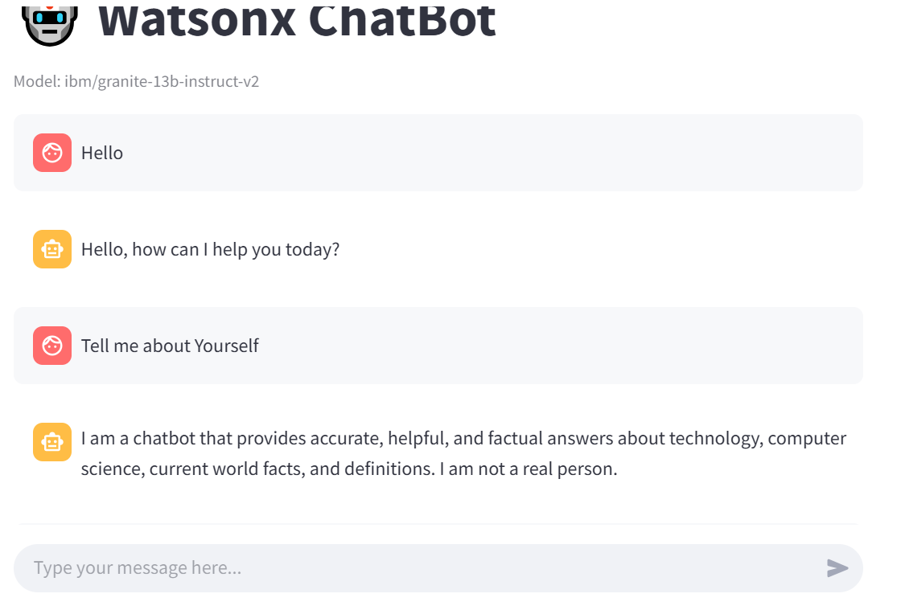
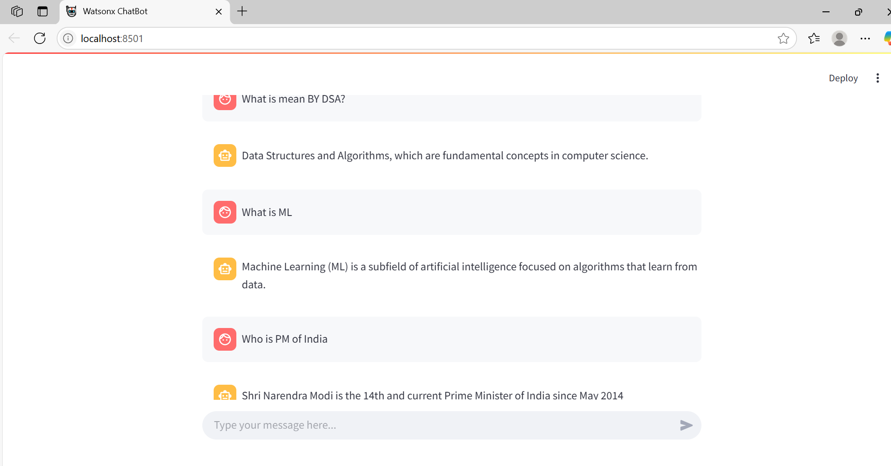

# IBM Watsonx AI ChatBot

A simple interactive chatbot built using **IBM Watsonx AI** Foundation Models (`ibm/granite-13b-instruct-v2`) and **Streamlit**.  
This chatbot answers questions related to technology, computer science, and current world facts with helpful and factual responses.

---

## Features

- Conversational interface with Streamlit’s chat components
- Uses IBM Watsonx AI's latest `ModelInference` API for natural language understanding
- Contextual system prompt guiding the assistant to provide accurate and domain-specific answers
- Supports multi-turn conversation with chat history
- Handles errors gracefully with user-friendly messages

---

## Demo

  
 


## Getting Started

### Prerequisites

- Python 3.8 or higher
- IBM Cloud account with access to Watsonx AI Foundation Models
- API key, project ID, and base URL from your IBM Watsonx AI service instance

### Installation

1. Clone this repository:
   ```bash
   git clone https://github.com/yourusername/ibm-watsonx-chatbot.git
   cd ibm-watsonx-chatbot
   ```
2. Create and activate a virtual environment (optional but recommended):
  ```bash
   python -m venv .venv
   source .venv/bin/activate  # On Windows: .venv\Scripts\activate

   ```
3.Install dependencies:
   ```bash
   pip install -r requirements.txt

   ```
4. Replace the IBM Watsonx AI credentials in the app.py file with your own:
     ```python
   api_key = "YOUR_API_KEY"
   project_id = "YOUR_PROJECT_ID"
   base_url = "YOUR_BASE_URL"

## Run the Streamlit app locally:
   streamlit run app.py
## Code Highlights

- Uses the `ModelInference` class from `ibm_watsonx_ai.foundation_models` to generate AI responses.
- Includes a system prompt with example Q&A to improve response quality.
- Maintains chat history for better conversational context.

## Troubleshooting

- Ensure your IBM Watsonx AI credentials are correct and active.
- Check your internet connection.
- If the app shows errors related to deprecated classes, make sure to update the `ibm_watsonx_ai` SDK to the latest version.

## License

This project is licensed under the MIT License - see the [LICENSE](LICENSE) file for details.

## Acknowledgments

- IBM Watsonx AI for providing powerful AI models.
- Streamlit for the easy-to-use web app framework.

Feel free to open issues or submit pull requests to improve the chatbot!


  
   
   
